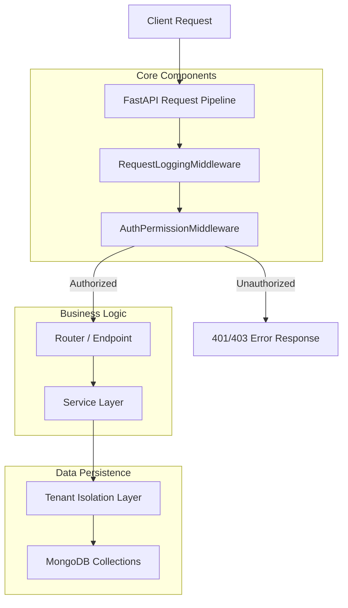

# Corely Backend Architecture Analysis

The backend of Corely is a sophisticated, multi-tenant enterprise system built with **FastAPI** and **MongoDB**. It follows a modular monolith pattern with clear separation of concerns via packages and a layered service architecture.

## High-Level Workflow



## Architectural Pillars

### 1. Multi-Tenant Isolation (Collection-Prefixing)
Corely uses a "Single Database, Multi-Collection" approach for multi-tenancy. 
-   **Global Data**: Global configurations and organization metadata are stored in shared collections (e.g., `organizations`).
-   **Tenant Data**: Data for specific organizations is isolated by prefixing collections with the organization's unique `slug`.
    -   *Example*: For an organization with slug `lhs`, collections are named `lhs_users`, `lhs_customers`, etc.
-   **Implementation**: This logic is encapsulated in the `tenant` utility, which dynamically resolves the correct collection name based on the `org_slug` extracted from the JWT.

### 2. Security & RBAC
Authentication and Authorization are implemented as early-stage middleware (`AuthPermissionMiddleware`).
-   **Identity**: Verified via JWT.
-   **Context**: The middleware extracts the `org_slug`, `user_role`, and `permissions` from the token and attaches them to `request.state`.
-   **RBAC**: A granular permission system mapping roles (Super Admin, Admin, Manager, Employee) to specific module actions (e.g., `customers:read`, `pos:*`).

### 3. Modular Monolith Design
The system is divided into self-contained packages under `base/`, each responsible for a specific domain.
-   **Core Modules**: `config`, `middleware`, `auth`, `rbac`.
-   **Domain Modules**: `users`, `products`, `pos`, [invoices](file:///b:/perpro/lhs-backend-20260228T185215Z-1-001/lhs-backend/base/invoices/service.py#314-349), `audit`, etc.
-   **Consistency**: Every module follows a similar internal structure (`routes.py`, [service.py](file:///b:/perpro/lhs-backend-20260228T185215Z-1-001/lhs-backend/base/pos/service.py), `schemas.py`).

### 4. Layered Service Pattern
The architecture separates the interface (API) from the implementation (Service).
-   **API (Routers)**: Handle HTTP concerns, request validation, and route-level authorization.
-   **Service Layer**: Encapsulates business logic and ensures tenant isolation when querying the database.
-   **Models/Schemas**: Pydantic models are used for data validation and transformation.

## Technology Stack
-   **Language**: Python 3.11+
-   **Web Framework**: FastAPI (Async-first)
-   **Database**: MongoDB with Motor (Async driver)
-   **Security**: JWT (python-jose), Passlib (bcrypt)
-   **Configuration**: Pydantic-settings (.env management)
-   **Audit**: Built-in audit logger for change tracking.

---

## Module Relationship Diagram

The following diagram illustrates how the various business modules interact with each other and the core tenant isolation layer.

```mermaid
graph LR
    subgraph "Core & Security"
        Auth[Auth Service]
        RBAC[RBAC / Middleware]
        Org[Organization Setup]
    end

    subgraph "Domain Modules"
        Items[Items / Products]
        Inv[Inventory / Stock]
        POS[POS / Sales]
        InvC[Invoicing / GST]
        Cust[Customers]
        Vend[Vendors]
    end

    subgraph "Analytics & Audit"
        Reports[Dashboard / Reports]
        Audit[Audit Logs]
    end

    %% Relationships
    Auth --> RBAC
    RBAC --> POS
    RBAC --> Inv
    
    POS --> Items : Updates Stock
    POS --> Inv : Creates Movements
    POS --> Cust : Links Sale
    
    InvC --> POS : Generates from Sale
    InvC --> Cust : Fetches Buyer Info
    
    Inv --> Items : Updates Stock
    Inv --> Vend : Purchase Entries
    
    Reports --> POS : Aggregates Sales
    Reports --> Inv : Stock Levels
    
    Audit -- "Tracks All" --> Domain[Domain Modules]
```

## Module Interactions Summary

| Module | Primary Responsibility | Key Relationship |
| :--- | :--- | :--- |
| **Auth & RBAC** | Identity & Permissions | Enforces access for all domain routes. |
| **POS (Sales)** | Transaction processing | Triggers **Inventory** movements and updates **Item** stock. |
| **Inventory** | Stock management | Handles Purchases from **Vendors** and Adjustments to **Items**. |
| **Invoicing** | Document Generation | Converts **POS Sales** into GST-compliant Tax Invoices. |
| **Customers** | CRM | Provides identity for **Sales** and **Invoices**. |
| **Reports** | Business Intelligence | Aggregates data from **Sales** and **Inventory** collections. |
| **Audit Logs** | Security/Compliance | Passively records every mutation across all collections. |

### The "Tenant Context" Thread
Every domain module service (e.g., [POSService](file:///b:/perpro/lhs-backend-20260228T185215Z-1-001/lhs-backend/base/pos/service.py#23-413), [InventoryService](file:///b:/perpro/lhs-backend-20260228T185215Z-1-001/lhs-backend/base/inventory/service.py#21-306)) is initialized with an `org_slug` provided by the `AuthPermissionMiddleware`. This slug is used by the `tenant` utility to ensure that every query is strictly scoped to the tenant's prefixed collections, guaranteeing zero data leakage between organizations.
